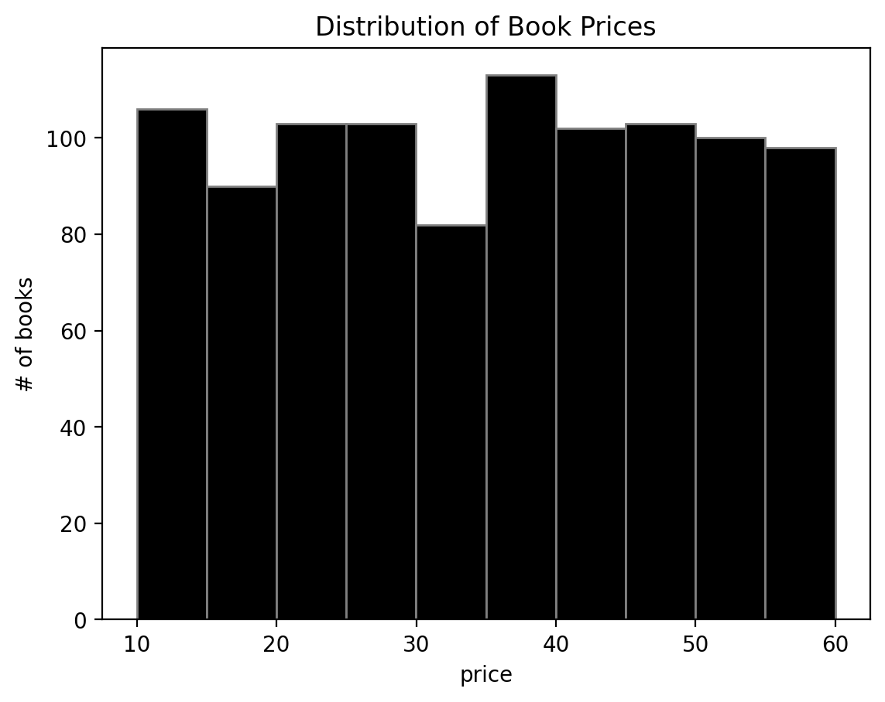
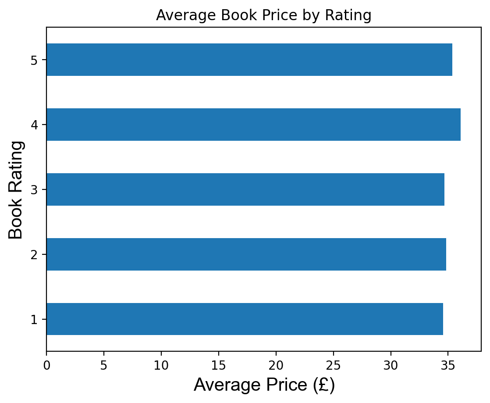
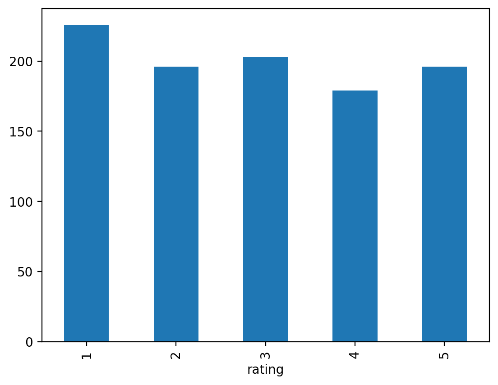

# book-price-analysis
End-to-end data pipeline scraping and analyzing 1000+ books to uncover pricing trends using Python, SQL, and data visualization.
# 📊 Book Price Analysis Pipeline

## 📌 Objective

To analyze how book prices vary with ratings using data collected through web scraping.

## ⚙️ Tech Stack

* Python
* Pandas
* MySQL
* Matplotlib

## 🔄 Pipeline Overview

1. Scraped 1000+ book records using BeautifulSoup
2. Cleaned and transformed raw data using Pandas
3. Stored structured data in MySQL database
4. Performed analysis on pricing trends
5. Visualized insights using charts

## 📊 Key Insights

- Books with higher ratings (4–5 stars) show slightly higher average prices, indicating a possible relationship between perceived quality and pricing  
- Most books are concentrated in a mid-price range, suggesting consistent pricing strategies across the catalog  
- The dataset is dominated by 3–4 star ratings, reflecting generally positive product quality  
- No significant presence of high-priced low-rated books, implying price alone does not determine ratings  

## 📷 Visualizations

### Price Distribution

### Price vs Rating

### Rating Count

## 🚀 Conclusion

This project demonstrates an end-to-end data pipeline from data collection to insight generation.
